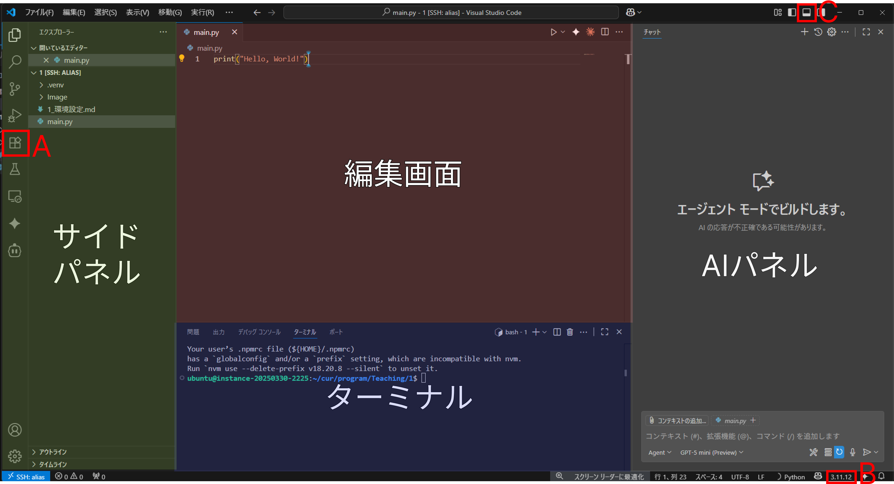

# Pythonの環境設定
藤嶋一行, 2025-08-22

## はじめに
Pythonをはじめるにあたって, まずは編集と実行の環境を整える必要があります. 今回は, Windows環境でVisual Studio Code[^1]を使用した環境を設定していきます. 

[^1]: IDE(統合開発環境)の一つで, プラグインを使用することで様々なプログラミング言語に対応が可能. Python用のIDEとしては, この他に[Pycharm](https://www.jetbrains.com/pycharm/)や[Google Colab](https://colab.research.google.com/)などがあり, それぞれに特徴があります. 特に, Google Colabはブラウザ上で動作し, 環境構築が不要なため手軽に始められます. 今回は, 手軽さと拡張性の高さからVisual Studio Codeを選びました. 

## 1. Pythonのインストール
Pythonをインストールするには、公式サイト([https://www.python.org/downloads/](https://www.python.org/downloads/))から最新の安定版をダウンロードし, インストーラーの指示に従ってインストールします. 

## 2. Visual Studio Codeのインストール
Visual Studio Codeをインストールするには, 公式サイト([https://code.visualstudio.com/](https://code.visualstudio.com/))から最新の安定版をダウンロードし、インストーラーの指示に従ってインストールします.

今後, 開発はVisual Studio Code上で行います. 画面の説明をしておきましょう. 

画像は筆者の環境なので, インストールした拡張機能などによって, 表示が異なる場合がありますが, 基本的な部分は同じです. 赤色の部分, 編集画面でコードを編集します. 黄色の部分, サイドパネル(サイドバー)は, ファイルの管理や拡張機能のインストールなどを行います. サイドパネルは, 一番左のアイコンをクリックすることで, 表示内容を切り替えることができます. 基本的には一番上のアイコン, 「エクスプローラー」を使用します. 青色の部分, ターミナルは, コマンドを実行するためのコンソールです. 画面下部に表示されますが, 表示されていない場合は, `Ctrl + Shift + ~` を押すことで表示できます.

## 3. Python拡張機能のインストール
Visual Studio Codeをインストールしたら, 次にVisual Studio CodeにPython拡張機能をインストールします. これにより、Pythonのコード補完やデバッグ機能が強化されます。拡張機能は, Visual Studio Codeの画面左側のサイドバーにある四つの四角形のアイコン(画像内「A」)をクリックし, 「Python」と検索することで見つけることができます. 表示されたら, 「インストール」ボタンをクリックしてインストールします.

また, 日本語化拡張機能をインストールしておくと便利です. 「Japanese」と検索して, 「Japanese Language Pack for Visual Studio Code」をインストールします. これにより、Visual Studio Codeのメニューや設定が日本語になります. 

## 4. プロジェクトフォルダの作成
任意の場所(例: ドキュメントフォルダ)に, プロジェクト用のフォルダを作成します. ここでは, `PythonProject` という名前で作成します. 次に, Visual Studio Codeを開き, 画面左上の「ファイル(F)」→「フォルダーを開く(O)...」をクリックし, 先ほど作成した `PythonProject` フォルダを選択して開きます. これで, プロジェクトの準備が整いました.

## 5. Venvの設定
Pythonはライブラリ[^lib]を使用して開発を行うことが多いですが, ライブラリ同士が競合することもあります. また, ライブラリのバージョンによっては, プログラムが動作しないこともあります. そのため, プロジェクトごとに仮想環境を作成し, そこでライブラリを管理することが推奨されています. 仮想環境を作成するために, Pythonには `venv` というモジュールが標準で用意されています. 

仮想環境を作成するには, 以下の手順を実行します.

1. まずは, Pythonのコードを記述するファイルを作成しておきます. 画面左上ロゴの隣, 「ファイル(F)」→「新しいファイル」をクリックし, `main.py` という名前で保存します.

2. main.pyを開き, 右下の「3.17.7」(インストールしたPythonのバージョン, 画像内「B」)をクリックします. もし, 表示されない場合は, `Ctrl + Shift + P` を押して, 「Python: Select Interpreter」と入力します. 

3. 表示されたメニューから, 「仮想環境を作成...」を選択します. その後「Venv」を選択し, バージョン(今回は3.17.7)を指定します. これで, 仮想環境が作成されます. 

## 6. ライブラリ(Pandas)のインストール
パネルの切り替えボタン(画像内「C」)をクリックして, ターミナルを表示します. もし, 表示されない場合は, `Ctrl + Shift + ~` を押します.

コンソールが表示されたら, 先頭に「(.venv)」と表示されていることを確認し, 以下のコマンドを入力して実行します.

```bash
python -m pip install --upgrade pip
python -m pip install pandas
```


先頭に, 「(.venv)」と表示されていない場合は, 以下のコマンドを入力して実行し, 仮想環境を有効化してから, インストールを実行します. 

```bash
.\.venv\Scripts\activate.bat
```

Pythonには, Pandas以外にも便利なライブラリが多数あります. 例えば, NumPy(数値計算), Matplotlib(グラフ描画), Scikit-learn(機械学習)などがあります. これらも同様に, `python -m pip install ライブラリ名` でインストールできます.


[^lib]: ライブラリは再利用可能なコードの集合（モジュールやパッケージ）で、データ処理や数値計算、HTTP 通信などの機能を提供します。代表的な例として NumPy（数値計算）、Pandas（データ解析）、Requests（HTTP）などがあります。通常は `pip` でインストールし、仮想環境（venv）でバージョンを分けて管理します。